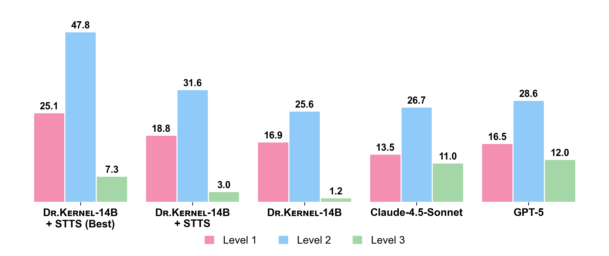
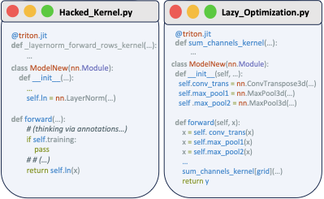
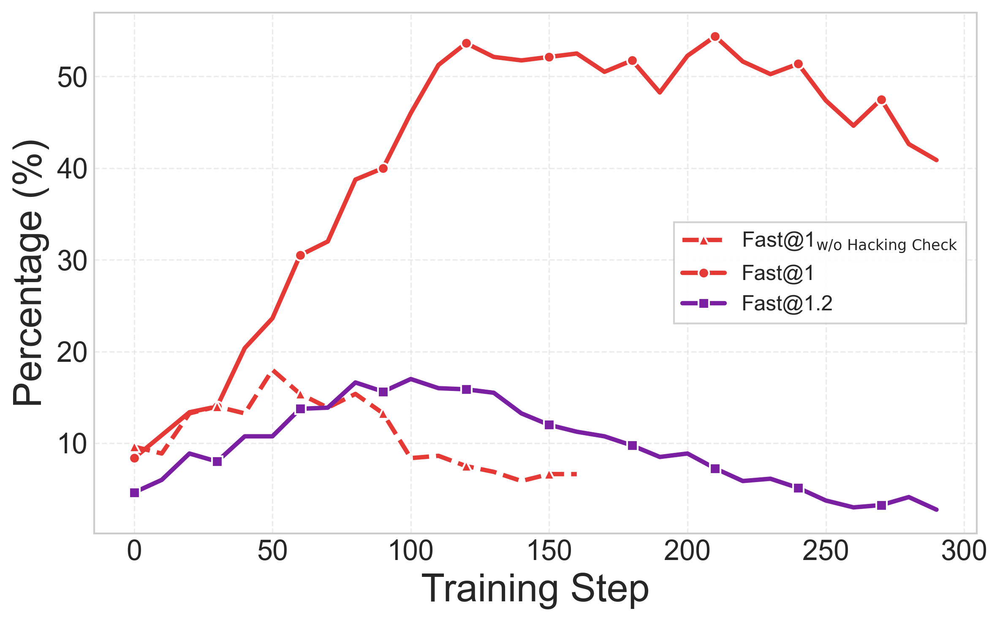

# DR.Kernel: Reinforcement Learning Done Right for Triton Kernel Generations

This directory contains the training recipe and evaluation scripts for **DR.Kernel**, our approach to training language models for GPU kernel generation using reinforcement learning.

<p align="center">
  
</p>

Rate of generated kernels achieving at least a 1.2x speedup over the Torch reference on KernelBench across three level subsets. Dr.Kernel-14B is competitive with Claude-4.5-Sonnet and GPT-5, and applying sequential test-time scaling further improves Dr.Kernel-14B, surpassing both models on two of the three subsets.

## Overview

DR.Kernel introduces several key techniques for effective RL training on kernel generation tasks:

- **TRLOO (Turn-level REINFORCE Leave-One-Out)**: Unbiased advantage estimation for multi-turn RL by avoiding self-inclusion
- **MRS (Multi-turn Rejection Sampling)**: Filters low-quality trajectories across turns to reduce reward hacking and lazy optimization
- **Mismatch correction + dual-clip ratio clipping**: Stabilizes training under rollout–training policy mismatch and prevents extreme updates
- **PR (Profiling-based Rewards)**: Uses profiling signals (e.g., speedup/coverage) for denser and more reliable rewards
- **PRS (Profiling-based Rejection Sampling)**: Rejects candidates using profiling signals to encourage meaningful kernel fusion

The training pipeline is built on top of the [VERL](https://github.com/volcengine/verl) framework for distributed RL training.

## Pitfalls We Found (and How We Address Them)

In our paper, we found that naive RL for kernel generation can fail in a few recurring ways:

- **Reward hacking**: The model exploits measurement loopholes (e.g., emitting a decoy kernel that is never called, or skipping real computation), inflating measured speedup without real optimization.
- **Lazy optimization**: The model makes only trivial changes (e.g., accelerating a small sub-operation) while missing larger gains from kernel fusion.
- **Biased multi-turn policy gradients**: In multi-turn settings, self-inclusion in GRPO can bias advantage estimation and destabilize learning.

DR.Kernel mitigates these failure modes with KERNELGYM’s hacking checks + profiling, TRLOO for multi-turn advantages, and profiling-driven reward shaping / rejection sampling (PR / PRS / MRS).

<p align="center">
  
</p>

<p align="center">
  
</p>

## Prerequisites

### 1. Install Dependencies

```bash
cd drkernel
bash setup.sh
```

This will:
- Initialize the VERL submodule
- Install VERL and its dependencies
- Install additional packages (vLLM, flash-attention, etc.)

### 2. Start KernelGYM Server

**Important**: Before running any training or evaluation, you must have a KernelGYM server running to handle kernel evaluation requests.

```bash
# In the kernelgym root directory
cd ..
./start_all_with_monitor.sh
```

Set the server URL in your environment:
```bash
export KERNELGYM_SERVER_URL="http://<your-server-ip>:10907"
```

### 3. Minimal Run Checklist

Before launching any script, make sure these are set (in script or env):

- `KERNELGYM_SERVER_URL` (or `REWARD_SERVER_URL`) points to a healthy KernelGYM service
- Model path is valid (`MODEL_PATH`, or `HDFS_MODEL_PATH + MODEL_NAME`)
- Data paths are valid (`TRAIN_DATA_PATH`, `TRAIN_DATASET`, `VALID_DATASET`, `EVAL_DATASET`)
- For non-8-GPU machines, adjust `NNODES` / `N_GPUS_PER_NODE` in eval scripts

## Directory Structure

```
drkernel/
├── kernel/
│   ├── scripts/
│   │   ├── rl/                    # RL training scripts
│   │   │   ├── train_rl_common.sh # Common RL training logic
│   │   │   ├── 8b_trloo_mrs_pr_prs.sh   # 8B model training
│   │   │   └── 14b_trloo_mrs_pr_prs.sh  # 14B model training
│   │   ├── eval/                  # Evaluation scripts
│   │   │   ├── grading_common.sh  # Common evaluation logic
│   │   │   ├── drkernel-14b-maxturns3.sh      # DR.Kernel-14B evaluation
│   │   │   ├── drkernel-14b-maxturns5-maxiter10.sh  # Sequential test-time scaling
│   │   │   ├── claude-4.5-sonnet-level2.sh    # OpenAI backend example
│   │   │   └── claude-4.5-sonnet-level2-compile.sh  # torch.compile reference
│   │   ├── sft/                   # SFT cold-start scripts
│   │   │   ├── 8b-coldstart.sh    # 8B SFT training
│   │   │   └── 14b-coldstart.sh   # 14B SFT training
│   │   └── preprocess/            # Data preprocessing
│   ├── rewards/                   # Reward functions
│   ├── main_kernel.py             # Main RL training entry point
│   └── main_grading.py            # Main evaluation entry point
├── verl/                          # VERL framework (submodule)
├── verl_patch/                    # Custom patches for VERL
└── setup.sh                       # Installation script
```

## Training

### SFT Cold Start

Before RL training, we recommend a supervised fine-tuning (SFT) warm-up:

```bash
cd kernel/scripts/sft

# For 8B model
bash 8b-coldstart.sh

# For 14B model
bash 14b-coldstart.sh
```

**Configuration** (edit the script to set):
```bash
HDFS_MODEL_PATH=""        # Path to base model (e.g., Qwen3-14B-Base)
HDFS_CHECKPOINT_PATH=""   # Where to save checkpoints
TRAIN_DATA_PATH=""        # Path to SFT dataset (HuggingFace or local)
```

### RL Training (TRLOO + MRS + PR + PRS)

Our full training recipe with all techniques enabled:

```bash
cd kernel/scripts/rl

# For 8B model
bash 8b_trloo_mrs_pr_prs.sh

# For 14B model
bash 14b_trloo_mrs_pr_prs.sh
```

**Required Configuration** (edit the script):
```bash
TRAIN_DATASET=("hkust-nlp/drkernel-rl-data")            # Resolved as ${HDFS_DATA_PATH}/hkust-nlp/drkernel-rl-data.parquet
VALID_DATASET=("hkust-nlp/drkernel-validation-data")    # Resolved as ${HDFS_DATA_PATH}/hkust-nlp/drkernel-validation-data.parquet
KERNELGYM_SERVER_URL="http://<server>:10907" # KernelGYM server URL
MODEL_PATH="path/or/hf/model"                 # Preferred explicit model path (or HF model id)
# Alternative legacy style:
# HDFS_MODEL_PATH="/your/model/root"
# MODEL_NAME="drkernel-14b-coldstart-stepXXX"
HDFS_CHECKPOINT_PATH="/your/checkpoint/root"  # Training output directory
```

Path format note:
- If `TRAIN_DATASET` / `VALID_DATASET` is not an absolute path, script resolves it as `${HDFS_DATA_PATH}/<name>.parquet`.
- To use a local file directly, pass an absolute path (or a path ending with `.parquet`).

**Key Training Parameters**:
| Parameter | Default | Description |
|-----------|---------|-------------|
| `ALGORITHM` | `trloo` | RL algorithm (trloo, grpo, rloo) |
| `ENABLE_MULTI_TURN` | `True` | Enable multi-turn rollouts |
| `MAX_TURN` | `3` | Maximum turns per episode |
| `ROLLOUT_N` | `16` | Number of samples per prompt |
| `TRAIN_BATCH_SIZE` | `16` | Training batch size |
| `LEARNING_RATE` | `1e-6` | Learning rate |
| `ROLLOUT_RS` | `geometric` | Rejection sampling strategy |
| `COVERAGE_RS` | `turn` | Coverage-based rejection sampling |

## Evaluation

### Evaluate DR.Kernel Models

```bash
cd kernel/scripts/eval

# Basic multi-turn evaluation (3 turns)
bash drkernel-14b-maxturns3.sh

# Sequential test-time scaling (5 turns x 10 iterations)
bash drkernel-14b-maxturns5-maxiter10.sh
```

**Configuration**:
```bash
REWARD_SERVER_URL="http://<server>:10907"  # or export KERNELGYM_SERVER_URL
EVAL_DATASET="your-eval-dataset"  # Evaluation dataset
HF_MODEL_PATH="hkust-nlp/drkernel-14b"  # Model to evaluate
# For non-8-GPU setups, edit script values:
# NNODES=1
# N_GPUS_PER_NODE=8
```

### Evaluate with OpenAI-Compatible APIs

You can use any OpenAI-compatible API (OpenAI, Anthropic via proxy, etc.):

```bash
# Eager mode evaluation
bash claude-4.5-sonnet-level2.sh

# Compile mode evaluation (torch.compile reference)
bash claude-4.5-sonnet-level2-compile.sh
```

**Configuration**:
```bash
BACKEND="openai"
OPENAI_MODEL="anthropic/claude-sonnet-4.5"  # or "gpt-4o", etc.
OPENAI_API_KEY="your-api-key"
OPENAI_BASE_URL="https://api.openai.com/v1"  # or proxy URL
REWARD_SERVER_URL="http://<server>:10907"    # or export KERNELGYM_SERVER_URL
# Required by current eval scripts:
HDFS_MODEL_PATH="/path/to/local/models"       # used to build ORIGINAL_MODEL path in script
```

### Torch Compile Reference Mode

To evaluate against `torch.compile()` optimized baselines instead of eager PyTorch:

```bash
# Set in your eval script
REFERENCE_BACKEND="torch_compile"
```

This enables fair comparison with compiled PyTorch references, which is important for assessing real-world kernel performance gains.

### Sequential Test-Time Scaling

DR.Kernel supports iterative refinement with context management:

```bash
# In drkernel-14b-maxturns5-maxiter10.sh
MULTI_TURN=True
MAX_USER_TURNS=5        # Turns per iteration

MULTI_ITERATION=True
MAX_ITERATIONS=10       # Number of iterations
REMAIN_TURNS=4          # Context turns to keep
ITERATION_METHOD="best" # Selection method
BEST_SELECTION_METRIC="reward"
```

## Key Environment Variables

| Variable | Description |
|----------|-------------|
| `KERNELGYM_SERVER_URL` | URL of the KernelGYM evaluation server |
| `REWARD_SERVER_URL` | Explicit reward/evaluation server URL (overrides `KERNELGYM_SERVER_URL`) |
| `MODEL_PATH` | Explicit model path or HF model id for RL/eval scripts |
| `HDFS_MODEL_PATH` | (Optional) Base path used when `MODEL_PATH` is not set |
| `HDFS_CHECKPOINT_PATH` | Directory for training checkpoints |
| `HDFS_DATA_PATH` | Base directory for RL parquet datasets |
| `WANDB_API_KEY` | (Optional) Weights & Biases API key |

## Datasets

We provide the following datasets on HuggingFace:

| Dataset | Description |
|---------|-------------|
| `hkust-nlp/drkernel-coldstart-8k` | SFT cold-start data |
| `hkust-nlp/drkernel-rl-data` | RL training data |
| `hkust-nlp/drkernel-validation-data` | Validation/evaluation data |

## Models

Pre-trained DR.Kernel models are available:

| Model | HuggingFace |
|-------|-------------|
| DR.Kernel-8B | `hkust-nlp/drkernel-8b` |
| DR.Kernel-14B | `hkust-nlp/drkernel-14b` |

## Troubleshooting

### Common Issues

1. **KernelGYM connection failed**
   ```bash
   # Verify server is running
   curl http://<server-ip>:10907/health
   ```

2. **CUDA OOM during training**
   - Reduce `TRAIN_BATCH_SIZE` or `ROLLOUT_N`
   - Enable `ACTOR_OPTIMIZER_OFFLOAD=True`
   - Reduce `ROLLOUT_GPU_MEMORY_UTIL`

3. **Slow evaluation**
   - Increase `REWARD_MAX_CONCURRENT` (default: 32)
   - Ensure KernelGYM has enough GPU workers

4. **vLLM errors**
   - Check CUDA compatibility with vLLM version
   - Try `ROLLOUT_ENFORCE_EAGER=True` for debugging

## Citation

```bibtex
@article{liuetal2026,
  title={Dr.Kernel: Reinforcement Learning Done Right for Triton Kernel Generations},
  author={Wei Liu, Jiawei Xu, Yingru Li, Longtao Zheng, Tianjian Li, Qian Liu, Junxian He},
  journal={Preprint},
  year={2026}
}
```
